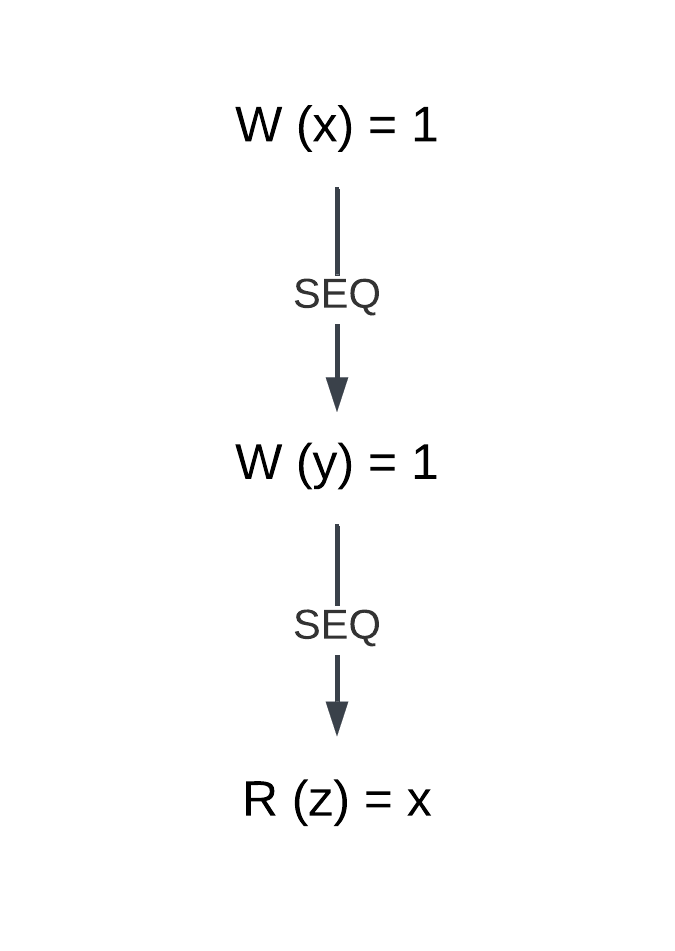
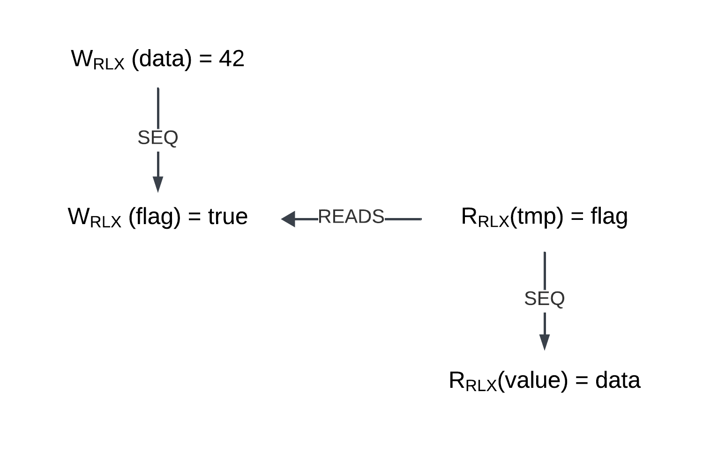
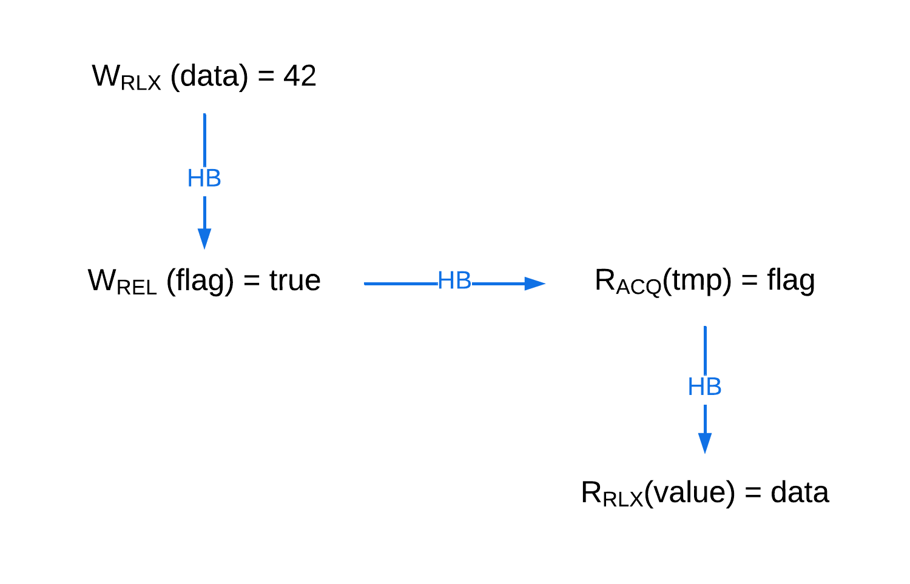
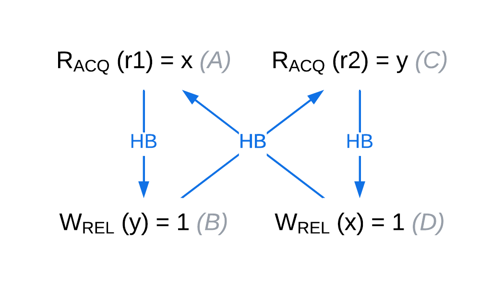

Atomic variables and operations may seem straightforward at first glance. 
But did you know that you can specify a `memory_order` for individual atomic operations? Why is this useful? 
By adjusting memory ordering, we can relax certain synchronization guarantees, which can lead to significant performance improvements. 
There's more to atomics than just ensuring "atomicity" in the sense of updates happening in a "single operation."

In this blog, we will delve into atomics and the memory model behind them, explaining how they work in greater detail. 
Both Rust and C++ share the same memory model for atomics. [^1]

[^1]: [Rust atomics](https://doc.rust-lang.org/std/sync/atomic/) 

## Introduction

There are multiple different CPU architectures implementing different memory models. 
For example, x86 and ARM have completely different memory models, each providing different guarantees and constraints.
Writing a program that works correctly across all architectures would be quite tedious.

This problem is eliminated by higher-level languages, which provide their own memory model as an abstraction layer. 
By programming against this model and following its rules, we can write efficient and correct programs that work seamlessly across different CPU
architectures.

One such model was introduced in C++11 and evolved over time into C++20 memory model. 
To understand how atomics work on a deeper level, we'll begin by establishing some basic relations 
and gradually progress to more complex ones. However, there will be one significant modification to the original C++20 model: 
we will omit or simplify certain relations to make it easier to understand. 
This simplification is based on the fact that `memory_order::consume` is generally discouraged. As the standard puts it:

> Prefer `memory_order::acquire`, which provides stronger guarantees than `memory_order::consume`.
> Implementations have found it infeasible to provide performance better than that of `memory_order::acquire`.
> Specification revisions are under consideration.

There are total of five memory orderings :

- `memory_order::relaxed`
- `memory_order::acquire`
- `memory_order::consume` (the "black sheep" of the family)
- `memory_order::release`
- `memory_order::seq_cst` (sequential consistency)

These memory orders are listed from the most relaxed to the most strict. 
When atomic operations are used without explicitly specifying a memory_order, they default to the strictest option: `memory_order::seq_cst`. 
We’ll take a bottom-up approach, starting with the most relaxed memory orders and gradually introducing more strict ones by adding additional relations and constraints.

The goal of this article is to provide a solid understanding of how atomics work wihtout going into too much detail.
Some relations and concepts will be simplified for clarity. For more in-depth explanations, you can refer to the C++ standard.


## Evaluation order (sequenced before)

Before we dvelve into memory orders we must start with Evaluation order. 
Evaluation order can be understood as simple 'program order'. When we think about a programs 
execution we think from top to bottom. 

```cpp
void foo() {
  int x = 1;  // A
  int y = 1;  // B
  int z = x;  // C
}
```

In this snippet we assume that A happens before B and B happens before C, that is our "mind model".
We expect that y would equal to 1 and z would equal to 3. 
In reality a compiler is allowed to do reorderings for performence benefits. However, the program must behave
"as-if" the instruction happened in this order. Again this shows, that as long as we follow the
rules of the standard compiler is allowed to do optimizations, as long as they do not 
break this "as-if" rule. 

Reordering can also happen on hardware level, which also does 
not concern us, we do not care on which level the reorderings happens as long as
we follow rules of the language we are safe.
Same holds for the memory model, we program against the 
model provided by the language.

The formal name for this relation is *sequenced-before*. A is *sequenced-before* B and B *sequenced-before* C.

- ***sequenced-before (SEQ)*** : Sequenced before is an asymmetric, transitive, pair-wise relationship between evaluations within the same thread.
  - If A is sequenced before B (or, equivalently, B is sequenced after A), then evaluation of A will be complete before evaluation of B begins.
  - If A is not sequenced before B and B is sequenced before A, then evaluation of B will be complete before evaluation of A begins. 

This is part of definition for program order, which for our purposes can understand more intuitivly, for full 
definition and rules you can refer to C++ standard.

We can create a graph using this relation : 



This graph is very simple. The *W(x)* signifies store into variable *x* and *R(z)* represents read(load) into variable *z*, and *SEQ* 
is *sequenced-before* relation. Further down we will use the same notation in a bit more complicated graphs
to show how different memroy orders form relations.

## Relaxed 

This is the least strict memory order, providing the fewest guarantees. 
Let's start with a problem that this memory order can solve.

```cpp
int counter = 0;

int main() {
  auto increment = []() {
    for (int i = 0; i < 10; ++i) {
        ++counter;
    }
  };
  // Create 3 threads
  std::thread t1(increment);
  std::thread t2(increment);
  std::thread t3(increment);
  // Join the threads
  t1.join(); t2.join(); t3.join();     
}
```
In this code snippet, we have a counter that is incremented by three threads. 
Each thread increments the counter by 1, ten times in a simple for loop. It's a straightforward example. 
However, we are using an ordinary int for the counter. So, what can possibly go wrong? 

Could we see a negative value? A typical illustrative problem occurs when one thread is reading while another is writing, 
causing the reading thread to potentially read gibberish. 
But does that really happen? It depends. For instance, on x86-64, a properly aligned int value is "atomic" 
in the sense that reads and and writes happen as one operation. 
This is due to how the hardware handles reads and writes, ensuring that these operations are atomic at the hardware level.
If it was not aligned properly, the CPU would need to do 2 reads to read the whole value.
A scenario where we would read a negative value cannot happen on properly aligned int on x86-64.

Given that individual read and write operations may be 'atomic' at the hardware level, 
do we still need to use atomic operations in our code? It turns out we do. 
Incrementing a variable involves multiple steps: reading its current value, 
adding one, and writing the new value back. 
If we run this program multiple times, we might observe that the counter is not equal to 30, but instead, for example, 25. 
Imagine two threads both read the value 5 from the counter; 
one thread stores 6 in the counter, and then the second thread does the same. 
In this scenario, we lose one increment, which is why proper atomic operations are needed.

This problem can be solved by using atomic variables. 
If we wrap the counter in an atomic type and use `memory_order::relaxed`, the counter will behave as expected, 
ensuring that increments are not lost while avoiding unnecessary synchronization overhead.

The following code correctly increments the counter.

```cpp
int std::atomic<counter> = 0;

int main() {
  auto increment = []() {
    for (int i = 0; i < 10; ++i) {
      // Specifying the opration to be std::memory_order_relaxed.
      counter.fetch_add(1, std::memory_order_relaxed);
    }
  };
  // Create 3 threads
  std::thread t1(increment);
  std::thread t2(increment);
  std::thread t3(increment);
  // Join the threads
  t1.join(); t2.join(); t3.join();     
}

```

Atomics and relaxed memory order gives us 2 guarantees:  
- With more complex types, operations will be atomic, meaning no partial updates. 
  It prevents a scenario where one thread reads part of a variable while another thread updates it, 
  avoiding the possibility of reading inconsistent or "gibberish" data.
- Ensures that operations such as incrementing a variable act as single, indivisible actions.

Relaxed atomics do not provide any synchronization guarantees between threads; 
for that, we need to use stricter memory orders. 
However, all the guarantees mentioned above, such as atomicity, 
are also provided by the stricter memory orders.

## Acquire and Release 

Once again, let's start by looking at a simple problem

```cpp
std::atomic<int> data(0);
std::atomic<bool> flag(false);

int main() {
  // Writer thread
  std::thread writer([]() {
    data.store(42, std::memory_order_relaxed);   // A  store data 
    flag.store(true, std::memory_order_relaxed); // B  Set flag
  });

  // Reader thread
  std::thread reader([]() {
    while (!flag.load(std::memory_order_relaxed))  { // C
      // Busy wait 
    }
    int value = data.load(std::memory_order_relaxed); // D
  });

writer.join();
reader.join();

return 0;
}
```


In this example, we have two threads:
- The writer thread writes data and then sets a flag.
- The reader thread busy-waits in a loop until the flag is set, and then it reads the data.

It is possible for the reader thread to see `flag = true` and `data = 0` ?
In other words, can the reader thread observe the flag set to true while the data has not yet been written?

Let's draw a graph with the *sequenced-before* relation and think about it:



**It is possible for the reader thread to see the flag as set, without reading the updated data**, 
meaning the reader could observe flag = true and data = 0. How? 
The *sequenced-before* relation **does not extend across threads**; 
it is only within a single thread that sequenced-before is established. 
To solve this problem, we need to extend this relation across threads. 
For that, we use `memory_order::release` in the writer and `memory_order::acquire` in the reader.

But first, we need to start with the *synchronizes-with* relation:

- ***synchronizes-with*** :
If a store in thread A uses `memory_order::release` and a load in thread B uses `memory_order::acquire`, 
and thread B reads the value stored by thread A, then the store in thread A synchronizes with the load in thread B.

As you can see, this relation is formed between two threads: one thread writes a value using `memory_order::release`, 
and the other thread reads that value using `memory_order::acquire`. 
In doing so, they "synchronize." The key point is that the reading thread must read the value stored 
by the writing thread for synchronization to occur. 
This synchronization happens only between the two threads. 

Now that we have the synchronizes-with relation, 
we need one more to fully model this problem (I promise it's the last one!) called *happens-before*. 
This relation is established if any of the following conditions are met:

- ***happens-before*** : Regardless of threads, evaluation A **happens-before** evaluation B if any of the following is true:
  - A is *sequenced-before* B (SB1)
  - A *synchronizes-with* B (SB2)
  - A *happens-before* X, and X *happens-before* B (SB3)

Now, why is this important? For the following reason:

- The side effect A on some variable X (a write) is visible to value computation B on X (a read) if both of the following are true:
  - A *happens-before* B.
  - There is no other side effect on X where A happens-before X and X happens-before B.


By establishing a *happens-before* relation, we have a guarantee that all modifications that *happens-before* a given 
expression are visible to that expression. This is similar to how sequenced-before works in sequential code.
From (SB1), it is clear that all *sequenced-before* relations are also *happens-before* relations. 
Looking at our graph, we just need to turn the *reads* relation into a *happens-before* relation, and the problem is solved. 
This guarantees that once we read true in the reader thread, the data write will be visible because it *happens-before* the read of the true value. 
In this way, we can "extend" the *sequenced-before* relationship between two threads.

To achieve this, we utilize (SB2). 
By turning the reads relation into a *synchronizes-with* relation, it essentially becomes *sequenced-before* as per (SB2). 
As we established earlier, *synchronizes-with* is achieved using a pair of `memory_order::acquire` and `memory_order::release`. 
To modify the code, we do the following:

```cpp
std::atomic<int> data(0);
std::atomic<bool> flag(false);

int main() {
  // Writer thread
  std::thread writer([]() {
    data.store(42, std::memory_order_relaxed);   // A  store data 
    flag.store(true, std::memory_order_release); // B  Set flag
  });

  // Reader thread
  std::thread reader([]() {
    while (!flag.load(std::memory_order_acquire))  { // C
      // Busy wait 
    }
    // Read data
    int value = data.load(std::memory_order_relaxed); // D
  });

writer.join();
reader.join();

return 0;
}
```

This translates into the following graph:




As the graph illustrates, A *happens-before* B, B *happens-before* C, and C *happens-before* D, therefore A *happens-before* D 
(as per SB3). 
Thus, we have a guarantee that once the reader thread reads true from the flag variable, 
it must also see the modification of the data variable.

Note that the data store and load operations are still using `memory_order::relaxed`.

The acquire and release memory orders allow us to form a *synchronizes-with* relation, 
which in turn establishes a *happens-before* relationship between threads. 
This gives programmers a guarantee that all modifications made by the releasing thread are visible to the 
acquiring thread when it reads the stored value.

However, it’s important to note that this does not guarantee the acquiring thread will always see the value stored by the 
releasing thread. If another thread modifies the data, 
the acquiring thread might see a "newer" value written by the third thread, or it might not, 
depending on timing. The only guarantee is that the acquiring thread will see all modifications made by the releasing thread.

## Worked example

There are a couple of good examples on cppreference, and we’ll work through one of them right here.

```cpp
// Thread 1:
r1 = x.load(std::memory_order_relaxed);  // A
if (r1 == 1)
  y.store(1, std::memory_order_relaxed); // B
// Thread 2:
r2 = y.load(std::memory_order_relaxed);  // C
if (r2 == 1)
  x.store(1, std::memory_order_relaxed); // D
```

In this case `r` variables are local variables (shorthand for registers). The question is is it possible
for that the program ends with `r1==1` and `r2==1` ? 

Let’s model this scenario with a graph.


Given that all operations use `memory_order::relaxed`, no *synchronizes-with* relation is formed, 
meaning there is no *happens-before* relation between the threads.

For the program to end with `r1 == 1` and `r2 == 1`, D would have to occur before A, and B would have to occur before C. 
However, this contradicts the *sequenced-before* relation established within each individual threads. 
And that’s completely fine, according to the memory model! The *sequenced-before* relation only applies within individual threads. 
Each thread can perceive a different modification order, meaning each thread sees its own "reality" or state of memory. 
They do not need to agree on a single total modification order across all threads.

The answer is **YES**, the result `r1 == 1` and `r2 == 1` is allowed by the memory model. 
From the perspective of individual variables, such as x, nothing prevents D from appearing before A 
in the modification order of that variable. 
However, each thread can observe the modifications in a different order. 
Once again, there is no global consensus among threads on the modification order. 
Such consensus can be achieved with `memory_order::seq_cst`, but not with `memory_order::relaxed`.

This type of issue is referred to as **out-of-thin-air** values because it appears as though the values come from nowhere. 
The memory model permits this behavior. However, the C++ standard discourages such behavior in implementations:
> This recommendation discourages producing r1 == r2 == 42, since the store of 42 to y is only possible if the store
> to x stores 42, which circularly depends on the store to y storing 42. Note that without this restriction, such an
> execution is possible.

```cpp
// Thread 1:
r1 = x.load(std::memory_order_acquire);  // A
if (r1 == 1)
  y.store(1, std::memory_order_release); // B
// Thread 2:
r2 = y.load(std::memory_order_acquire);  // C
if (r2 == 1)
  x.store(1, std::memory_order_release); // D
```

Is it possible for the program to end with `r1 == 1` and `r2 == 1`? Let’s draw a graph to visualize this.



In the graph, we can clearly see a cycle. 
The difference is that the memory model forbids such cycles with *happens-before* relation. 
Therefore, this execution cannot happen. The answer is **NO**.

As you may have noticed, we haven't yet covered the `seq_cst` memory order. 
In the next part, we will explore this memory order in detail along with additional worked examples.

##### References


